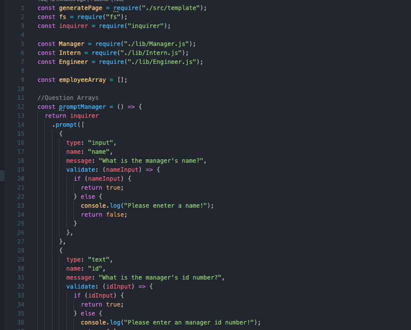
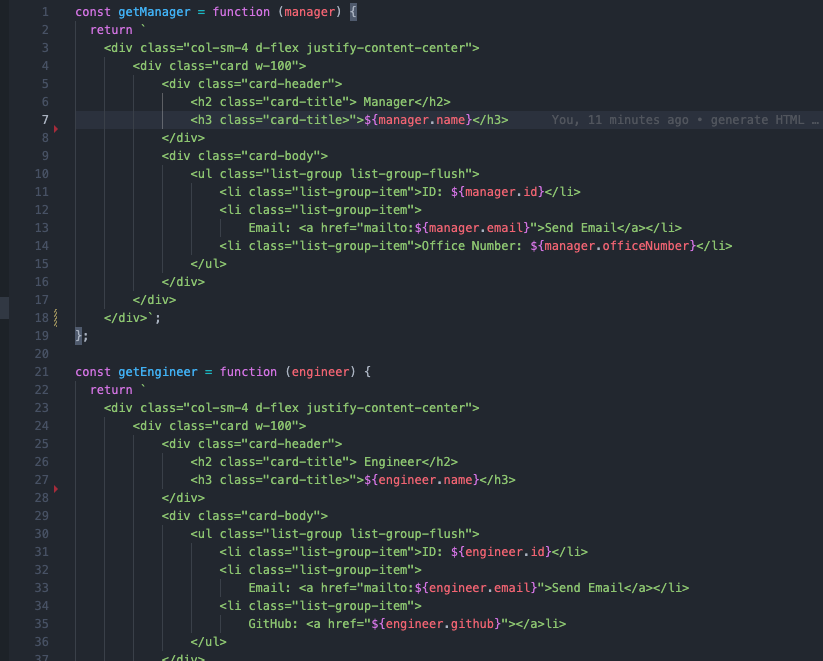
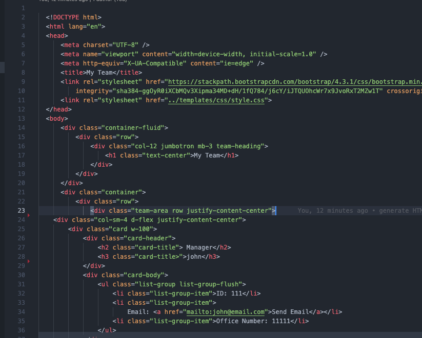
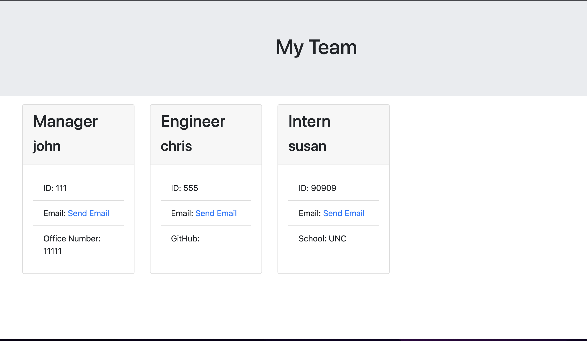

# Team-Profile-Generator
  ## Description
  This command-line app prompts the user for information about their professional team. The data is then used to generate a webpage.  The user is first prompted to add a manager to the project which entails name, id number, email, and office room number.  The user can then add engineers and interns to the team.  The questions alos ask for name, email, and id for those roles, however it also prompts for a github username for engineers and a school for interns.  The answeres to the prompts are sent through a template which generates the data into an HTML file.

  Created with javascript, node.js, inquirer, jest, HTML, and bootsrtap.

  ## Table of Contents

  * [Installation](#installation)
  * [Usage](#usage)
  * [Contributing](#contribution)
  * [Tests](#tests)
  * [Questions](#questions)
  * [Media](#media)

  ## Installation
  In the command line, install inquirer and jest by running "npm install"  then run the app by entering "node index.js".

  ## Usage
  Use this app to generate an HTML webpage that displays the members of the team. 

  ## Contributing
  Chris Hodges

  ## Questions
  For questions, please email chrisdhodges12@gmail.com or find me on GitHub at https://github.com/sd.

  ## Media

 
Index.js

 
Template

 
Generated html

 
Deployed webpage

 
Video walkthrough:

https://drive.google.com/file/d/19n58BIp4t29qcKxMwhXhewhKLB-qeRJu/view